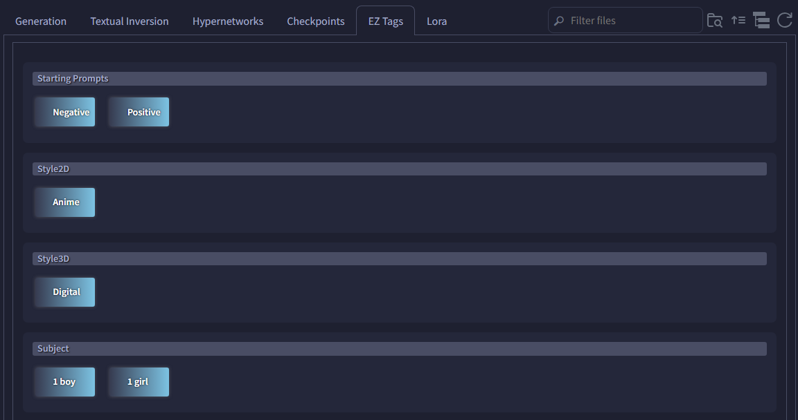
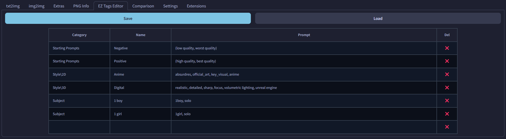

# SD Webui Easy Tag Insert
This is an Extension for the [Automatic1111 Webui](https://github.com/AUTOMATIC1111/stable-diffusion-webui), which trivializes inserting prompts.

> Also supports [Forge](https://github.com/lllyasviel/stable-diffusion-webui-forge)

<p align="center">
<br>
<i>(<a href="https://github.com/Haoming02/catppuccin-theme">Catppuccin Theme</a>)</i>
</p>

## How to Use
This Extension creates customizable buttons in a new `Extra Networks` tab, "**EZ Tags**." When clicked, the buttons will add your specified string into either the **Positive** or the **Negative** prompt field.

## Use Cases
You can use this Extension to simply make shortcuts for long prompts:

```yaml
Positive: (high quality, best quality)
Negative: (low quality, worst quality)
```

This is useful for LoRA **trigger words**, especially those that contain multiple concepts/characters:

```yaml
Chara1: trigger1, <lora:all_chara_pack:0.75>
Chara2: trigger2, <lora:all_chara_pack:0.75>
Chara3: trigger3, <lora:all_chara_pack:0.75>
```

## How to Edit Cards
The cards are loaded from the `.tag` files inside the `cards` folder. On a fresh install, the Extension will automatically rename the `examples` folder to `cards`. You may add/remove cards by modifying the Table in the **EZ Tags Editor** tab:

- Press the **Load** button first to load the cards into the Table
  - If you write anything before pressing **Load**, they will be overwritten
  - To add a new card, simply write a new entry in the last row
    - The Table will automatically expand
    - Completely empty rows are deleted
  - To remove a card, press the `❌` button
  - You can have `\` character in **Category** for better grouping; these get created as sub-folders
    - Do **not** add `\` in **Name**
  - Order of the cards does not matter
- Press the **Save** button to save the tags into the folder
  - Rows with any column empty will be **ignored**
- You can then live reload the entries by pressing the **Refresh** button in the `Extra Networks`, without having to restart the UI

<p align="center">

</p>

## Setting
You can go to the `EZ Tags` section under <ins>User Interface</ins> in the **Settings**, and disable the use of the provided custom style. This reverts the cards back to the native Webui look, and allows you to add preview images to the cards.
