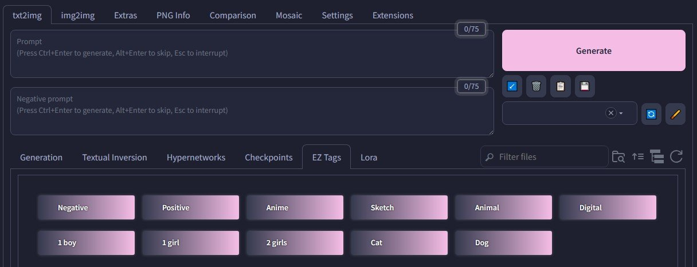

# SD Webui Easy Tag Insert
This is an Extension for the [Automatic1111 Webui](https://github.com/AUTOMATIC1111/stable-diffusion-webui), which trivializes inserting prompts.

> Compatible with [Forge](https://github.com/lllyasviel/stable-diffusion-webui-forge)~

<p align="center">
<br>
<i>(<a href="https://github.com/catppuccin/stable-diffusion-webui">Catppuccin Theme</a>)</i>
</p>

> This Extension has been updated to work for the latest version of the Webui.
If you're using an older version, please refer to [Releases](https://github.com/Haoming02/sd-webui-easy-tag-insert/releases).

## How to Use
This Extension creates buttons in a new `Extra Networks` tab, **EZ Tags**.
When clicked, it will add the specified string into the prompt field.

## Use Cases
You can use this Extension to simply make shortcuts for very long prompts:
```yaml
  Positive: (high quality, best quality)
  Negative: (low quality, worst quality:1.2)
```

This is especially useful with LoRAs, such as those that contain multiple concepts using different **trigger words**:
```yaml
  Chara1: trigger1, <lora:franchise:0.75>
  Chara2: trigger2, <lora:franchise:0.75>
```

## How to Edit Entries
The tags are loaded from the `.tag` files inside the `cards` folder. You may edit the entries by modifying the table in the **EZ Tags Editor** tab:

- Press the **Load** button to load the tags into the table
  - **folder**: The path used to filter/categorize
  - **filename**: The displayed name of the buttons
  - **prompt**: The strings to add to the field
- Press the **Save** button to save the tags into the `cards` folder
  - Rows with any column empty will be skipped
  - Empty folder will be deleted afterwards
- If no `cards` folder is present (**eg.** fresh install), it will automatically copy the `samples` folder to `cards`
- You can live reload the entries after editing by pressing the **Refresh** button, without restarting the UI

## Sorting
You can toggle the sorting between multiple modes:

- First by `Category`, then by `Display Name`
- By `Index` *(the order they are loaded in)*
- First by `Category`, then by `Index`
- By `Display Name`
