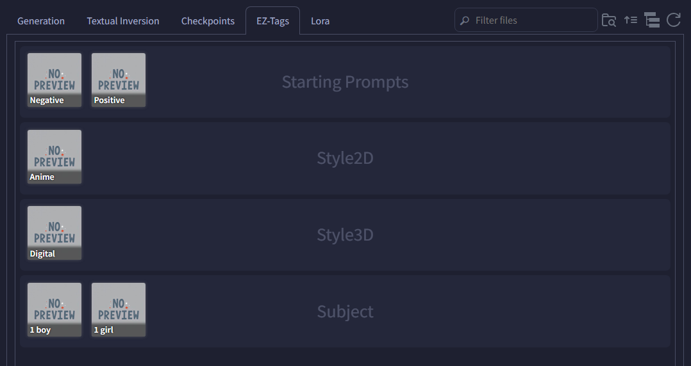

# SD Webui Easy Tag Insert
This is an Extension for the [Automatic1111 Webui](https://github.com/AUTOMATIC1111/stable-diffusion-webui), which trivializes inserting prompts.

> Compatible with [Forge](https://github.com/lllyasviel/stable-diffusion-webui-forge)

<p align="center">
<br>
<i>(with <code>Group the Cards based on Categories</code> enabled)</i>
</p>

## How to Use
This Extension creates a new "Extra Networks" tab - **EZ-Tags**. You can customize the cards so that they insert the specified prompts when clicked. Support both **Positive** and **Negative** prompt fields.

## Use Cases
You can use this Extension to simply make shortcuts for long prompts:

```yaml
Positive: (high quality, best quality)
Negative: (low quality, worst quality)
```

This is useful for LoRA **trigger words**, especially those that contain multiple concepts/characters:

```yaml
Chara1: trigger1, <lora:all_chara_pack:0.75>
Chara2: trigger2, <lora:all_chara_pack:0.75>
Chara3: trigger3, <lora:all_chara_pack:0.75>
```

## How to Edit Cards
The cards are loaded from the `.tag` files inside the `cards` folder. On a fresh install, the Extension will automatically rename the `examples` folder into `cards`. You may add/remove cards by modifying the Table in the **EZ Tags Editor** tab:

- Press the **Load** button first to load the cards into the Table
  - To add a new card, simply write a new entry in the last row
    - The Table will automatically expand
    - Completely empty rows will be deleted
  - To remove a card, press the `❌` button
  - You can have `\` character in **Category** for better grouping; these get created as sub-folders
    - Do **not** add `\` in **Name**
  - Order of the cards does not matter
- Press the **Save** button to save the tags into the folder
  - Rows with any column empty will be **ignored**
- You can then live reload the cards by pressing the **Refresh** button in the `Extra Networks`, without having to restart the UI

<p align="center">

</p>

## Settings
> *found in the `EZ Tags` section under the <ins>User Interface</ins> category of the **Settings** tab*

- **Group the Cards based on Categories:** This create a new row per category, to help you find the card more easily
  - Recommended to lower the card size if enabled
